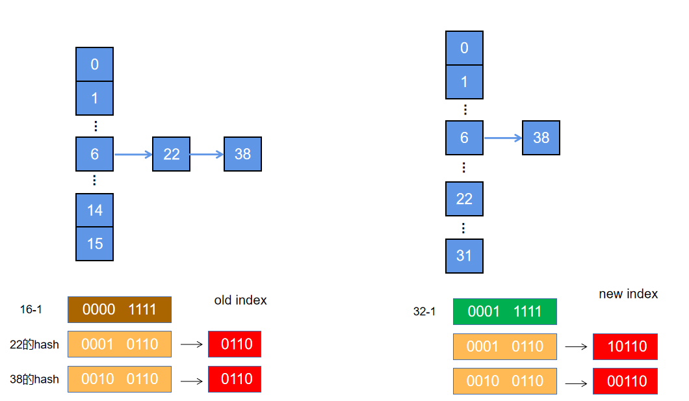
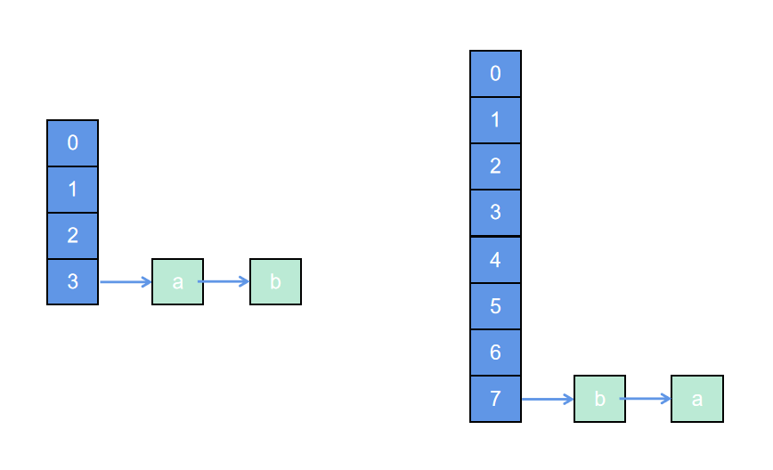
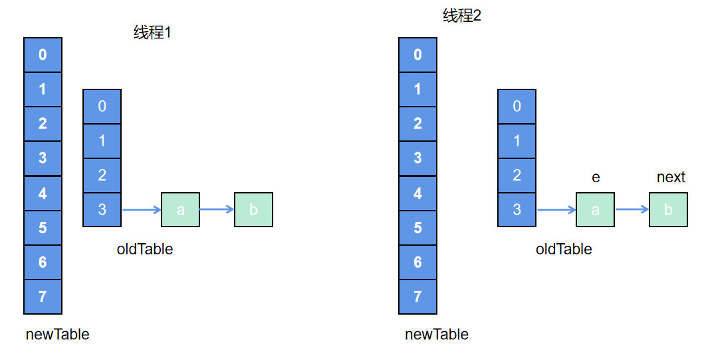
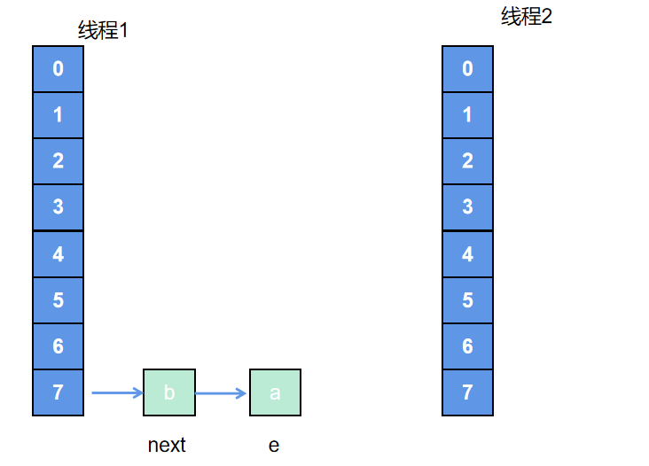
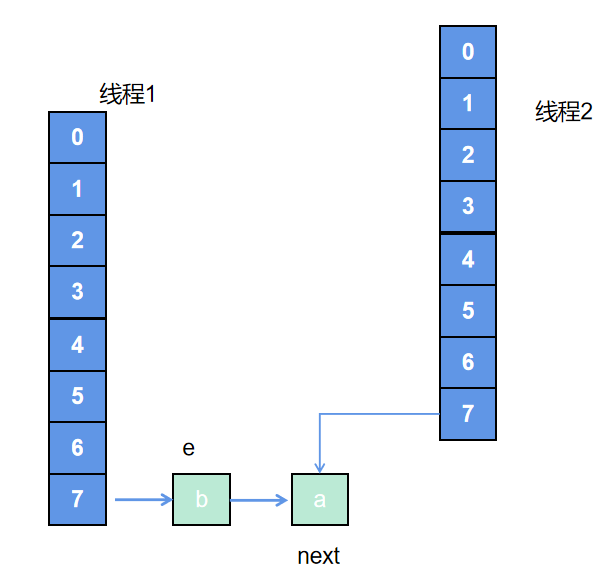
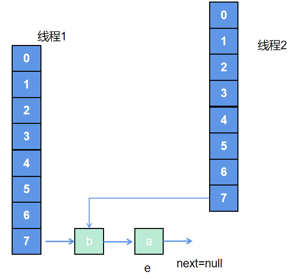
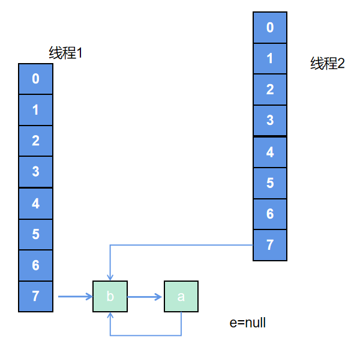

在jdk1.8中，hashMap的resize()函数做了相应的调整，尤其是对于在buckets的链表中，官方给出的该resize()函数主要在两种情况下使用：

1. 初始化的时候
2. 将哈希表扩容成之前的两倍时

下面首先看初始化时，实际的resize()函数做了哪些工作：
```
final Node<K,V>[] resize() {
    Node<K,V>[] oldTab = table;
    int oldCap = 0 ;
    int oldThr = threshold;
    int newCap, newThr = 0;
    // 初始化传过来时候threshold为0
    newCap = DEFAULT_INITIAL_CAPACITY; // 16 
    newThr = (int)(DEFAULT_LOAD_FACTOR * DEFAULT_INITIAL_CAPACITY); // 0.75*16=12
    
    threshold = newThr;
    @SuppressWarnings({"rawtypes","unchecked"})
    Node<K,V>[] newTab = (Node<K,V>[])new Node[newCap];
    table = newTab;
    return newTab;
}
```
从代码逻辑来看，初始化时resize()就是将 threshold=12，以及 table=new Node[16];

当哈希表需要扩容时：
```
final Node<K,V>[] resize() {
    Node<K,V>[] oldTab = table;
    int oldCap =  oldTab.length;
    int oldThr = threshold;
    int newCap, newThr = 0;
    // 下面这个if中主要是将 newCap=2*oldCap，newThr=2*oldThr
    if (oldCap > 0) {
        if (oldCap >= MAXIMUM_CAPACITY) {
            threshold = Integer.MAX_VALUE;
            return oldTab;
        }
        else if ((newCap = oldCap << 1) < MAXIMUM_CAPACITY &&
                    oldCap >= DEFAULT_INITIAL_CAPACITY)
            newThr = oldThr << 1; // double threshold
    }
    else if (oldThr > 0) // initial capacity was placed in threshold
        newCap = oldThr;
    else {               // zero initial threshold signifies using defaults
        newCap = DEFAULT_INITIAL_CAPACITY;
        newThr = (int)(DEFAULT_LOAD_FACTOR * DEFAULT_INITIAL_CAPACITY);
    }
    // 想不出什么时候会出现
    if (newThr == 0) {
        float ft = (float)newCap * loadFactor;
        newThr = (newCap < MAXIMUM_CAPACITY && ft < (float)MAXIMUM_CAPACITY ?
                    (int)ft : Integer.MAX_VALUE);
    }
    threshold = newThr; // threshold=2*oldThreshold
    @SuppressWarnings({"rawtypes","unchecked"})
    Node<K,V>[] newTab = (Node<K,V>[])new Node[newCap];
    table = newTab;
    // 将原来哈希表中的数据移到新的table里面
    if (oldTab != null) {
        for (int j = 0; j < oldCap; ++j) {
            Node<K,V> e;
            if ((e = oldTab[j]) != null) {
                oldTab[j] = null;
                if (e.next == null)                            // 此处的bucket只有一个元素，后边没接链表
                    newTab[e.hash & (newCap - 1)] = e;
                else if (e instanceof TreeNode)                // 此处的bucket下为红黑树
                    ((TreeNode<K,V>)e).split(this, newTab, j, oldCap);
                else { // preserve order                       // 此处bucket后接了链表
                    Node<K,V> loHead = null, loTail = null;
                    Node<K,V> hiHead = null, hiTail = null;
                    Node<K,V> next;
                    do {
                        next = e.next;
                        if ((e.hash & oldCap) == 0) {
                            if (loTail == null)
                                loHead = e;
                            else
                                loTail.next = e;
                            loTail = e;
                        }
                        else {
                            if (hiTail == null)
                                hiHead = e;
                            else
                                hiTail.next = e;
                            hiTail = e;
                        }
                    } while ((e = next) != null);
                    if (loTail != null) {
                        loTail.next = null;
                        newTab[j] = loHead;
                    }
                    if (hiTail != null) {
                        hiTail.next = null;
                        newTab[j + oldCap] = hiHead;
                    }
                }
            }
        }
    }
    return newTab;
}
```

可以看到，在对哈希表扩容后，resize()还做了一个最重要的工作，就是将原来table中的数据转移到新的table当中，大概有三种情况：
1. oldTable[i]处只有一个元素e： 转到新的newTable中，位置应该为：newTable[e.hash&(newCap -1)]
2. oldTable[i]处为树节点：之后在讨论
3. oldTable[i]后接了一个链表：重点讨论

如下图：

在扩容时，newTable的容量变为原来的两倍，要把链表上的元素迁移到newTable上，需要按照 ```e.hash & (newCap -1)``` 计算出该元素在newTable上的哪个bucket里面。

由于hashMap的容量总是2的倍数，那么在计算新的索引位置时，与操作的结果就是将原来元素的hash值再高一位与1进行&操作，为0的结果为0，为1的结果为1. 当hash值高一位为0时，在newTable的索引与之前的一样；当hash值高一位为1时，newTable的索引相当于oldTable上的索引+ oldTable的长度。可以参照上面的22和38.

所以，官方给出jdk1.8中resize()的注释是：**经过rehash之后，元素的位置要么是在原位置，要么是在原位置再移动2次幂的位置。**

为了判断原来hash值高一位是0还是1，jdk1.8直接```(e.hash & oldCap)```来判断，结果等于0原来高一位就是0，否则就是1。这样正好也就形成了两个新的链表，loHead-->loTail还在原来的bucket中，hiHead--->hiTail处于新的位置。新的链表的顺序和原来的一致。

## jdk1.7 resize

在jdk1.7中，resize()方法与1.8大体类似，也是扩容，具体：
```
void resize(int newCapacity) {   //传入新的容量
    Entry[] oldTable = table;    //引用扩容前的Entry数组
    int oldCapacity = oldTable.length;
    if (oldCapacity == MAXIMUM_CAPACITY) {  //扩容前的数组大小如果已经达到最大(2^30)了
        threshold = Integer.MAX_VALUE;      // 修改阈值为int的最大值(2^31-1)，这样以后就不会扩容了
        return;
    }

    Entry[] newTable = new Entry[newCapacity];  //初始化一个新的Entry数组
    transfer(newTable);                         //！！将数据转移到新的Entry数组里
    table = newTable;                           //HashMap的table属性引用新的Entry数组
    threshold = (int) (newCapacity * loadFactor);//修改阈值
}
```
其中transfer()函数是将oldTable元素转移到newTable中,具体实现：
```
void transfer(Entry[] newTable) {
    Entry[] src = table;                   //src引用了旧的Entry数组
    int newCapacity = newTable.length;
    for (int j = 0; j < src.length; j++) { //遍历旧的Entry数组
        Entry<K, V> e = src[j];             //取得旧Entry数组的每个元素
        if (e != null) {
            src[j] = null;//释放旧Entry数组的对象引用（for循环后，旧的Entry数组不再引用任何对象）
            do {
                Entry<K, V> next = e.next;
                int i = indexFor(e.hash, newCapacity); //！！重新计算每个元素在数组中的位置
                e.next = newTable[i];                  //标记[1]
                newTable[i] = e;                       //将元素放在数组上
                e = next;                              //访问下一个Entry链上的元素
            } while (e != null);
        }
    }
}
```
比较难理解的是```e.next=newTable[i]; newTable[i] = e; e=next;```几个操作：

i是e元素在newTable中的索引位置，这几个操作相当于是把e这个元素放在newTable[i]位置上，原来newTable[i]处有元素的话，按照链表往后排，也就是相当于 **新元素插在链表的头位置**。

## resize()造成多线程死循环

在jdk1.7版本当中，因为e.next与e的问题，所以在多线程中由于并发问题形成有环链表，在get查找时可能会形成死循环。

其形成过程如下：

1. 存在一个hashmap如图左侧，在索引为3的位置有链表a-->b，当扩容时resize为右图所示，恰好a,b还处于新的索引位置7, 不过按照1.7顺序正好颠倒；

    

2. 多线程时，假设线程1和线程2同时执行，都会创建新的数组，但是线程2执行到 next=e.next时，cpu切换到线程1上，如下图，此时e指向a，next指向b；

    

3. 线程1上述操作正常的transfer了oldTable，但是还没有执行```table=newTable```，此时线程1切换到线程2，状态如下：

    

4. 线程2继续执行之后的逻辑：

    ```
    Entry<K, V> next = e.next;
    int i = indexFor(e.hash, newCapacity); //！！重新计算每个元素在数组中的位置
    e.next = newTable[i];                  //标记[1]
    newTable[i] = e;                       //将元素放在数组上
    e = next; 
    ```

    * 将a指向索引7，e指向元素b，next指向b的next即元素a，如图4-1
    * 因为e不为null，继续执行循环体，在线程2中同样形成b-->a的链表，同时e指向next即元素a，如图4-2
    * 再次执行循环体，next为a.next即为null，然后将a.next指向newTable[i]，此时即为b，形成a,b相互引用，如图4-3
    * 因为e指向next为null，transfer结束

    
    
    

由上可见，jdk1.7中多线程能形成环状，除了没有相应同步机制的原因，主要因为有一个倒序(每次把元素指向bucket首位)的问题。在jdk1.8中多线程不会出现上述resize后成为有环链表的问题，但是多线程的本质问题还是存在。

